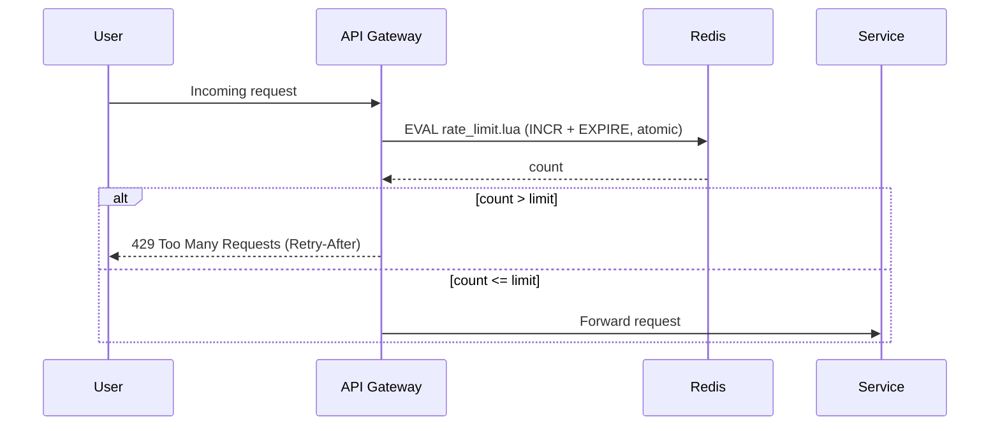

# Rate Limiter — Sequence Flow

*Companion to [02-rate-limiter-nalsd.md](./02-rate-limiter-nalsd.md) and [02-rate-limiter-math-pass.md](./02-rate-limiter-math-pass.md) — this is the request-level sequence for a single check, not the capacity math.*

## Notes

- **One Redis round trip per request.** The gateway never issues `INCR` and `EXPIRE` as two separate calls — that gap is exactly the race condition covered in doc 02 (Section 5). A single `EVAL` running the Lua script executes both atomically server-side, so there's nothing for a concurrent request to race against.
- **The branch is decided entirely at the gateway**, using only the `count` value Redis returns. Redis has no concept of "allow" or "reject" — it just returns a number; the limit comparison and the resulting `429` are gateway-side logic.
- **On limit exceeded**, the service is never called. The gateway short-circuits and returns `429 Too Many Requests` with a `Retry-After` header directly to the user — this is the enforcement point, not the service.
- **On allowed**, the request proceeds to the service with no further Redis involvement for this check (a second check would only happen if the service itself has its own, stricter per-endpoint limiter — see doc 02, Section 4's layered placement).
