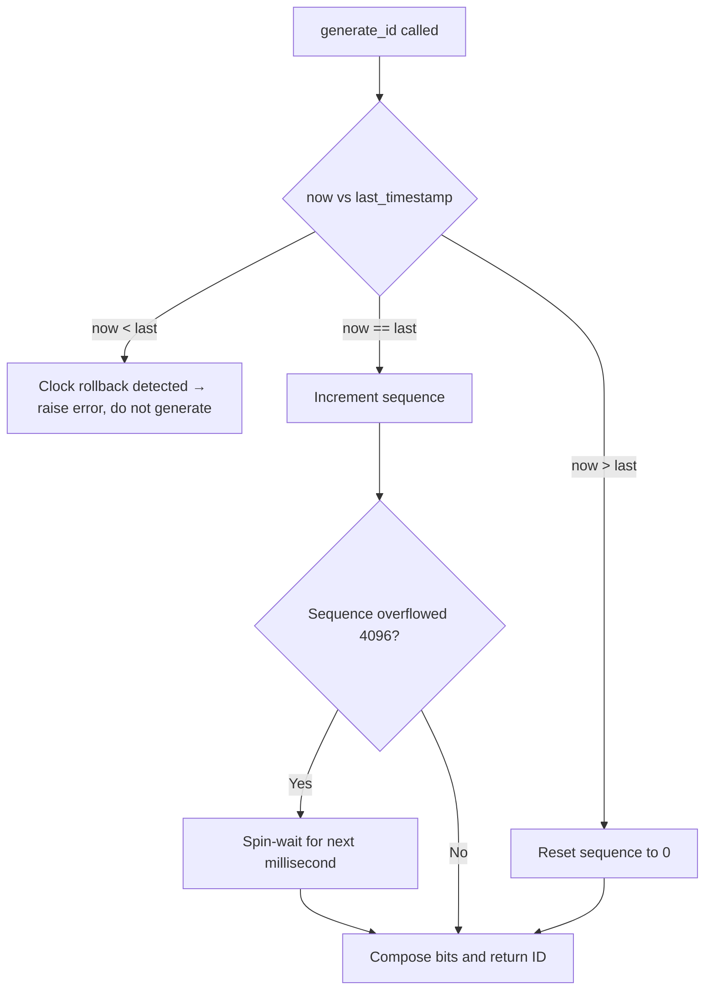

# Unique ID Generator — Comprehensive NALSD Reference

*Fifth in the system-design set. First doc under the new one-stop format — design, capacity math, bit-layout deep dive, and diagrams all in a single pass rather than split across companion docs.*

*Direct callback to two earlier docs: [01-url-shortener](../system-design/01-url-shortener-nalsd.md) needed a globally-unique ID generator internally (the range-allocator pattern for Base62 encoding), and [03.1-distributed-kv-store](../system-design/03.1-distributed-kv-store-nalsd.md) needed coordinator IDs for vector clocks. This doc is what "a proper unique ID generator" actually looks like when it's the thing being designed, not a supporting detail inside something else.*

---

## 1. Requirements & Capacity Estimation

### Functional requirements
- Generate a **globally unique** identifier, callable at high frequency, with **no per-call coordination between machines** — this last part is the whole design problem. (Contrast with doc 01's shortener, which solved uniqueness via a *centralized* range-allocator that machines periodically call — a legitimate approach, but one this design explicitly tries to avoid needing at all on the hot path.)
- IDs should be **roughly time-sortable** — an ID generated later should generally be numerically larger than one generated earlier. This isn't a nice-to-have: it directly determines database index performance (see Section 3).
- **Compact** — must fit in a standard 64-bit integer column, not a 128-bit or string type, for storage and index efficiency.

### Non-functional requirements
- **No single point of failure or contention on the generation path.** A centralized ticket server (doc 01's pattern) works, but every ID costs a network round trip to a shared service — fine for the shortener's ~1,500 writes/sec, a real bottleneck if *every* service in a large architecture wants IDs at once.
- **High local throughput** — a single machine should be able to generate very large numbers of IDs per second without any network call at all.
- **Long usable lifespan** before running out of ID space — decades, not years, for something meant to be foundational infrastructure.

### Scale target
Assume this generator is meant to serve as shared infrastructure across many services in a large architecture — not one application's need, similar in spirit to doc 03's KV store being a shared primitive.
- **Target throughput: 1,000,000 IDs/sec, cluster-wide, at peak**, generated by up to **hundreds of concurrent machine instances**.
- **Target lifespan: 20+ years** before the ID space is exhausted, matching a "build it once, stop thinking about it" infrastructure expectation.

---

## 2. API Design

```
generate_id() -> uint64
```
That's the entire public contract, and its simplicity is deliberate: this is designed to be an **embedded library call**, not a network API. The whole point of the design in Section 3 is that a machine never has to ask anyone else for permission to mint a new ID — contrast this explicitly with doc 01's `POST /shorten`, which *did* need a network round trip to the range allocator.

---

## 3. The Crux Decision — How Do You Get Uniqueness Without Coordination?

### Option A: UUID v4 (128-bit random)
- Trivial to generate locally, no coordination needed, collision probability negligible at any realistic scale.
- **Fails two of the stated requirements outright:** 128 bits (double the target size), and — the more operationally serious problem — **completely random, not time-sortable.** Inserting randomly-ordered keys into a B-tree-indexed database column causes constant page splits and poor locality (each insert lands in a random location across the index rather than appending to the end), which is a real, measurable write-amplification and fragmentation cost at scale, not a theoretical concern.

### Option B: Centralized auto-increment / ticket server
- This is doc 01's range-allocator pattern, reapplied here: a shared, highly-available service hands out unique integers (or blocks of them).
- Perfectly sequential and compact, but reintroduces the coordination dependency this design is explicitly trying to avoid on the hot path — every ID (or every block-exhaustion event) requires reaching a shared service. Legitimate design, wrong fit for "no per-call network dependency."

### Option C: Snowflake — timestamp + machine ID + local sequence
Twitter's Snowflake design (and its many descendants — Sony's Sonyflake, Instagram's ID scheme, Discord's snowflakes) solves this by **encoding enough locally-known information into the ID itself that no machine ever needs to ask another machine anything** to guarantee global uniqueness:

```
64 bits total:
┌─┬───────────────────────────────────────┬──────────────┬────────────┐
│0│         41 bits: timestamp (ms)         │ 10 bits: mID │12 bits: seq│
└─┴───────────────────────────────────────┴──────────────┴────────────┘
 ^                    ^                            ^              ^
 sign bit        ms since custom epoch      up to 1024 machines  4096/ms
 (always 0)                                                      per machine
```

- **1 unused/sign bit** — kept at 0 so the resulting value is always a positive signed 64-bit integer, for compatibility with languages/DBs whose native integer type is signed (Java `long`, many SQL `BIGINT` columns) — a real, practical interoperability reason, not an arbitrary waste of a bit.
- **41 bits: timestamp**, milliseconds since a **custom epoch** (the service's own launch date, not Unix epoch 1970) — using a custom epoch instead of 1970 recovers years of otherwise-wasted range, since the system will never need to represent timestamps from before it existed.
- **10 bits: machine/worker ID** — a value each generator instance is assigned once (Section 6), not computed per-ID.
- **12 bits: per-machine, per-millisecond sequence number** — resets to 0 at the start of every new millisecond, increments for each ID generated within that same millisecond on that same machine.

**Why this guarantees global uniqueness with zero coordination between machines**: any two IDs generated by *different* machines are automatically distinct, because they carry different machine-ID bits, regardless of timestamp or sequence value. Any two IDs generated by the *same* machine are distinct because the sequence counter increments within a millisecond, and the timestamp itself advances across milliseconds — **uniqueness is a structural property of the bit layout, not something enforced by checking against other machines.** This is the entire reason no per-ID network call is needed.

**Decision: Snowflake is the correct choice** against every stated requirement — compact (64 bits, fits a signed bigint), roughly time-sortable (the timestamp occupies the high bits, so IDs are numerically increasing over time, giving B-tree-friendly, append-mostly index locality — directly solving UUID v4's fragmentation problem), and requires no per-call coordination (directly solving the ticket server's bottleneck).

---

## 4. Capacity Math on the Bit Layout

**Timestamp range (41 bits):**
```
2^41 ms = 2,199,023,255,552 ms
÷ 1000 (ms→s) ÷ 60 ÷ 60 ÷ 24 ÷ 365.25 (s→years)
≈ 69.7 years
```
Comfortably exceeds the 20-year target from Section 1 — with a custom epoch set at launch, this design has decades of headroom before any timestamp-bit exhaustion concern.

**Machine ID space (10 bits):**
```
2^10 = 1,024 distinct concurrently-active machine IDs
```

**Sequence space (12 bits) — per-machine, per-millisecond throughput ceiling:**
```
2^12 = 4,096 IDs per machine per millisecond
× 1,000 ms/sec = 4,096,000 IDs/sec per single machine
```

**Theoretical cluster-wide maximum:**
```
4,096,000 IDs/sec/machine × 1,024 machines = 4,194,304,000 IDs/sec
```

**Compare to the Section 1 target of 1,000,000 IDs/sec cluster-wide: the theoretical ceiling is over 4,000x the target.** This is worth stating plainly rather than treating as a non-finding: **raw ID-generation throughput is never going to be the binding constraint for this design** — a single machine's 4,096,000/sec local ceiling alone already exceeds the entire cluster-wide target by 4x. The actual bottleneck, worked out in Section 7, is something else entirely.

---

## 5. Generation Algorithm

```
function generate_id():
    now = current_time_ms()

    if now < last_timestamp:
        # Clock moved backward — see Section 8. Never silently proceed.
        raise ClockRollbackError

    if now == last_timestamp:
        sequence = (sequence + 1) & 0xFFF        # 12-bit wraparound
        if sequence == 0:
            # Exhausted this millisecond's 4096 IDs — wait for the next one
            now = wait_until_next_millisecond(last_timestamp)
    else:
        sequence = 0

    last_timestamp = now
    return (now << 22) | (machine_id << 12) | sequence
```



The only genuinely tricky branch is the leftmost one — clock rollback — which gets its own section because it's the actual correctness hazard in this design (Section 8), the same way the cache-aside invalidation race was the actual correctness hazard in doc 04.

---

## 6. Machine ID Assignment — the One-Time Coordination This Design Still Needs

Snowflake avoids coordination **per ID**, but it can't avoid it entirely: something still has to guarantee no two concurrently-running generator instances are ever handed the same machine ID, or the uniqueness guarantee from Section 3 breaks immediately. Three real approaches:

- **Static configuration** — hand-assign machine IDs via config file/environment variable. Simple, but manual and error-prone at any real fleet size; a copy-paste config error silently creates a collision with no automatic detection.
- **Zookeeper/etcd ephemeral sequential nodes** — each generator instance registers an ephemeral node on startup and is assigned the next available sequential ID; the node (and therefore the ID) is automatically released if the instance crashes or shuts down, allowing safe reuse. This is the standard production approach.
- **A range-allocator row, directly reusing doc 01's pattern** — a small coordination table hands out machine IDs the same way doc 01's ID allocator handed out Base62-encoding ranges. The key difference, worth stating explicitly: **doc 01 needed this coordination once per ~1M generated shortener IDs (a block); this needs it once per machine's entire lifecycle** — dramatically less frequent, which is exactly why Snowflake's per-ID path can stay fully local while still ultimately tracing back to a one-time coordinated assignment.

---

## 7. The Real Bottleneck — Machine ID Space, Not Throughput

Section 4 already showed raw throughput has roughly 4,000x headroom. **The actual constraint that bites in practice is the 1,024-slot machine ID space** — and it shows up in a specific, realistic deployment scenario that's easy to miss if you only check the throughput math.

**The scenario:** a modern microservices architecture running on Kubernetes, where the natural instinct is to give **every pod its own embedded ID generator** to fully realize the "no network call" benefit from Section 3. During an autoscaling event, a service's pod count can spike well past 1,024:
```
Example autoscale event: 5,000 concurrent pods, each wanting its own machine ID
Available machine ID space: 1,024

5,000 > 1,024 → machine ID space exhausted by ~5x
```
**This is the first real bottleneck**, and it's a genuinely different *category* of bottleneck than any prior doc in this series found — not a throughput ceiling, not a storage limit, not a probability calculation, but an **address-space exhaustion problem**, triggered by a deployment pattern (many ephemeral pods) rather than by request volume at all.

### Iterate — three ways to fix it

**Option A: Widen the machine ID field, steal bits from the sequence.** E.g., 12-bit machine ID (4,096 slots) and 10-bit sequence (1,024 IDs/ms/machine):
```
New per-machine ceiling: 1,024/ms × 1,000ms = 1,024,000 IDs/sec/machine
New cluster ceiling: 1,024,000 × 4,096 machines = 4,194,304,000 IDs/sec
```
**Notice this is exactly the same theoretical cluster maximum as Section 4's original 10/12 split** — because the total bit budget for machine+sequence (22 bits) didn't change, only how it's divided. Reallocating bits between "more concurrent machines" and "more per-machine burst capacity" is free in total-throughput terms; it only trades which dimension has more headroom. Given Section 4 already showed throughput was never the binding constraint, this trade is essentially free — widen the machine ID field with no real cost.

**Option B: Don't give every ephemeral pod its own machine ID — reintroduce a small, deliberate network hop.** Run a small, fixed pool of long-lived dedicated ID-generator services (e.g., 100–200 instances, well within the machine ID budget regardless of app-tier autoscaling), and have app pods fetch **batches** of IDs (e.g., 1,000 at a time) from them rather than one ID per network call. This is a direct structural echo of doc 01's range-allocator pattern — amortizing a network round trip across many IDs rather than paying it per ID — applied here specifically to keep the machine-ID-consuming tier small and stable rather than tied to arbitrary app-level autoscaling.

**Option C: Lease-based reuse.** Keep the Zookeeper/etcd ephemeral-node approach from Section 6, so a machine ID is reclaimed the moment its pod scales down — this bounds *concurrent* usage to actual concurrent pod count rather than cumulative pods ever created, but it's still hard-capped at whatever the machine ID field size is (1,024, or 4,096 under Option A) — it delays exhaustion, it doesn't remove the ceiling.

**Recommendation:** Option B is the most robust for a genuinely elastic, high-pod-count architecture — it keeps the machine ID space usage decoupled from application-tier autoscaling entirely, at the cost of a small, batched (not per-ID) network dependency, which is a good trade given Section 4 already established raw generation throughput was never the scarce resource here.

---

## 8. Clock Rollback — the Real Correctness Hazard

Machine clocks aren't perfectly monotonic — NTP corrections, VM live-migration, or a misconfigured time source can all cause a system clock to jump **backward**. If a generator naively kept producing IDs using a rolled-back clock, it could reissue a `(timestamp, machine_id, sequence)` combination that's numerically **smaller** than an ID it already handed out — breaking the time-sortable property from Section 1, and in a worse case, colliding with an ID already generated (if the exact same timestamp+sequence combination recurs on the same machine).

**This matters even for small rollbacks.** A rollback of just 1ms is enough to threaten correctness — it doesn't take a dramatic clock jump, just a clock that goes backward *at all* while the generator keeps running.

**The defensive pattern (Section 5's pseudocode)**: track `last_timestamp` explicitly, and if `now < last_timestamp` is ever observed, **refuse to generate and raise an error** rather than silently proceeding — the generator waits (or fails the request) until the clock catches back up past the last timestamp it used. This is a deliberate "fail loud, not silently wrong" choice: an ID generator that occasionally throws a brief error during a clock correction is far preferable to one that silently produces non-monotonic or colliding IDs that corrupt downstream assumptions (index locality, causal ordering) without anyone noticing until much later.

---

## 9. Final Summary

| Dimension | Value | Binding constraint? |
|---|---|---|
| Timestamp range | ~69.7 years (41 bits, custom epoch) | No — far exceeds the 20-year target |
| Per-machine throughput | 4,096,000 IDs/sec | No — single machine alone exceeds the cluster-wide target |
| Cluster-wide theoretical throughput | ~4.19 billion IDs/sec | No — ~4,000x the 1,000,000/sec target |
| Machine ID space | 1,024 (or 4,096 with a widened field) | **Yes — the actual bottleneck, triggered by pod-count autoscaling, not request volume** |
| Clock monotonicity | Assumed, must be defended explicitly | Correctness hazard, not a capacity one — handled by fail-loud rollback detection |

**What makes this doc's finding distinct from the prior four topics:** every earlier math pass broke on a *quantity* — not enough throughput, not enough storage, too high a failure probability, not enough headroom. This one breaks on an **address space** — a fixed-width field that's structurally incapable of holding more than 1,024 (or 4,096) distinct values no matter how much raw throughput or storage capacity the rest of the system has to spare. Worth having as the closing insight for this topic: a bottleneck doesn't have to come from load at all — it can come from a design constant chosen for a bit-layout reason (compatibility, compactness) that turns out to interact badly with an unrelated deployment pattern (ephemeral pod autoscaling) years after the format was fixed.

## 10. Follow-up Questions

- **"Why not just make the machine ID field bigger from the start?"** — every bit given to machine ID is a bit taken from either timestamp (Section 4, shortening the 69.7-year lifespan) or sequence (Option A, lowering per-machine burst capacity) — it's a real design-time trade, not a free lunch, even though Section 7 showed this particular trade is cheap given how much throughput headroom exists.
- **"How do real systems (Discord, Instagram) handle this?"** — most published Snowflake variants use broadly the same layout with minor bit-width differences tuned to their own priorities (e.g., Discord's snowflakes use a slightly different split); the underlying trade-offs in this doc are the same regardless of the exact split chosen.
- **"What happens if two data centers each run their own machine-ID-assignment pool and get merged?"** — a real operational risk: if two independently-operated fleets both assigned machine ID `47` to different machines, merging them (or routing traffic between them) reintroduces a collision. The fix is making machine ID assignment (Section 6) globally coordinated across the merged scope from the start, not per-fleet — worth naming as a gap that only becomes visible at organizational scale, not at individual-fleet scale.
