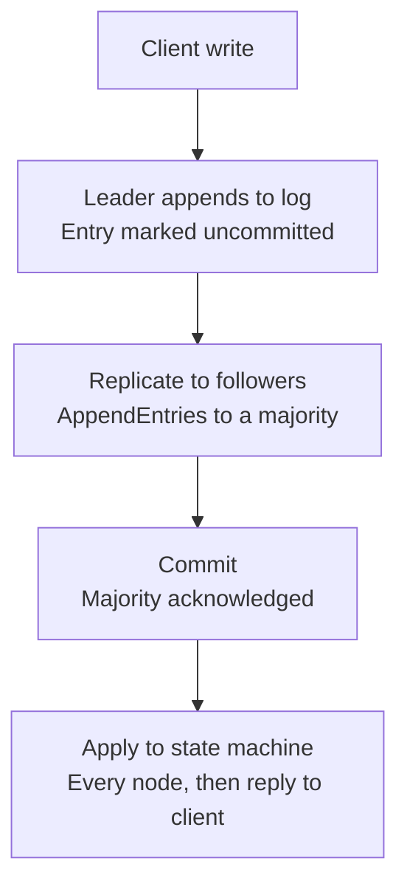
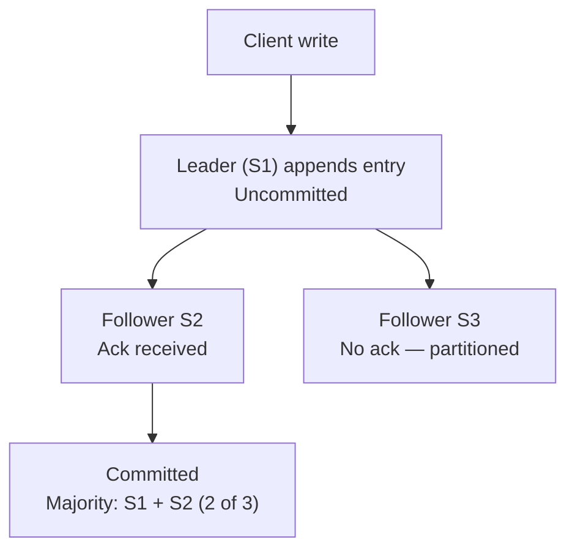
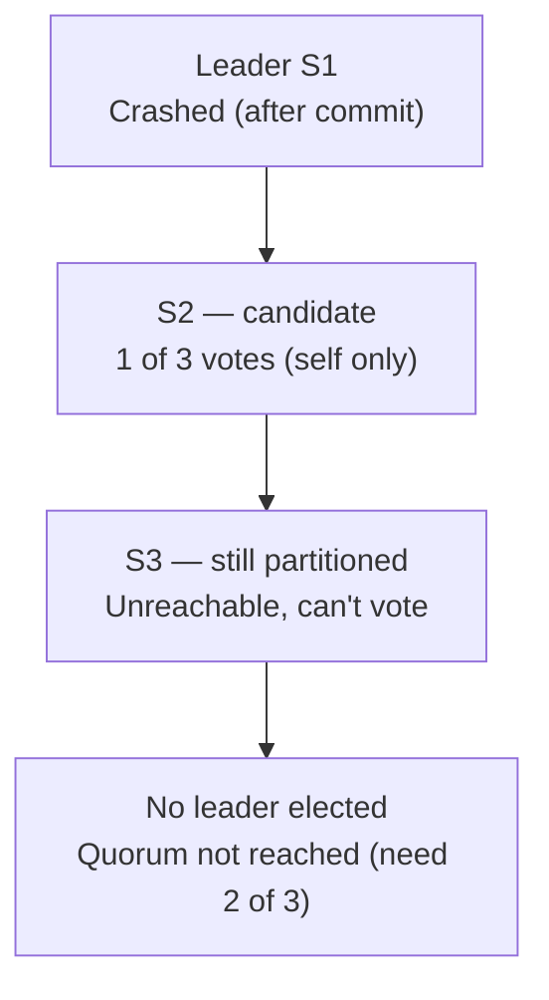
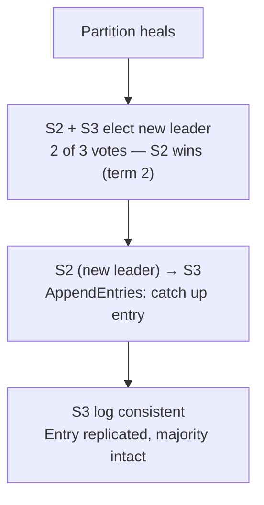

# Raft Log Replication — Diagrams

*Companion to [14-distributed-lock-service.md](./14-distributed-lock-service.md). Mermaid instead of raw SVG so these render natively on GitHub and don't depend on any rendering tool being available.*

---

## 1. Happy path: client write → leader append → replicate → commit → apply

**Commit and apply are genuinely separate steps, worth keeping distinct**: an entry can be committed (durable, majority-acknowledged) before it's been applied to the state machine on every node — this matters directly for read consistency, since a node that hasn't yet applied a committed entry would serve a stale read even though the write is already safe.

---

## 2. Partitioned follower and leader crash — three-phase scenario

Same setup as doc 14, Section 3's split-brain discussion, worked through as a concrete timeline: a 3-node cluster (S1 leader, S2 healthy follower, S3 partitioned follower).

### Phase 1 — write commits despite a partitioned follower

S3 never responds, but the entry still commits — S1 and S2 alone already form a majority out of 3.

### Phase 2 — leader crashes, election stalls

**The important, easy-to-miss detail**: with the leader down *and* S3 still partitioned, S2 genuinely cannot elect itself — it only has its own vote. The cluster is correctly unavailable for writes here, not stuck due to a bug. This is the majority-overlap guarantee (doc 14, Section 3) doing exactly its job, even though the visible effect is a stall.

### Phase 3 — partition heals, new leader elected, S3 catches up

If S1 recovers after this, it rejoins as an ordinary follower and receives `AppendEntries` to catch up — Raft never allows two leaders in the same term, so S1 can't simply resume where it left off believing it's still in charge.

---

## Follow-up note

Worth having this timeline as a single mental model for doc 14's fencing-token discussion (Section 5): the *lock service's* split-brain prevention (this doc) and *fencing tokens* (protecting a downstream resource from a client that's merely slow, not actually partitioned) are solving two different failure shapes — this diagram set is entirely about the former.
